# Pepolon Frontend 

**Author:**  
_Burak Inan_   
_burakinan.dev@gmail.com_

---

## Description:

The Pepolon is built using NextJS to provide a user-friendly interface for managing various entities within an job application platform. This frontend seamlessly integrates with the backend project, offering administrators, tenants, and organizations a comprehensive set of features to interact with the Job application platform.

## Technologies Used:

- **React:** A JavaScript library for building user interfaces, providing a responsive and dynamic front end.

- **Next:** A React framework that enables server-side rendering, static site generation, and other advanced features to enhance React applications.

- **Nex-Auth:** An authentication library for Next.js, simplifying the implementation of authentication and authorization features in Next.js applications.

- **React Redux:** State management library for React applications, ensuring efficient and predictable state handling.

- **SWR:** Stands for "Stale-While-Revalidate," a React Hooks library for remote data fetching that enables efficient caching and real-time updates.

- **Bootstrap:** A CSS framework for building responsive and visually appealing user interfaces.

- **React Bootstrap:** Bootstrap components as React components, enhancing UI development with pre-built elements.

- **React Hook Form:** A library for managing forms in React applications, offering a simple and efficient way to handle form state and validation.

- **Zod:** A TypeScript-first schema declaration and validation library, allowing developers to define data structures with strong typing and validation.

- **React Icons:** A library providing a collection of popular icons as React components.

- **PrimeReact:** A UI library providing a set of high-quality React components for building interfaces.

- **React Avatar Editor:** A React component that provides an easy-to-use interface for editing and customizing avatars within a web application.

- **React Scripts:** A set of scripts and configurations for bootstrapping and managing React applications.

- **SweetAlert2:** A library for creating beautiful and customizable alert modals in web applications.

These technologies and libraries collectively contribute to the development of a robust, responsive, and feature-rich frontend for the Student Management System.

## Key Features:

### User Authentication and Authorization:

- **Secure Authentication:** Robust user authentication system ensuring secure login for users.
- **Role-Based Authorization:** Role-based access control for different parts of the application, limiting access based on user roles.

### Intuitive User Interface:

- **Profile Overview:** An intuitive dashboard providing a comprehensive summary of key information.
- **User-Specific Views:** Tailored views for visitors, users and owners of the profiles ensuring a personalized experience.

### Management Functionality:

- **Profile Management:** Exclusive features and capabilities for owners, allowing efficient management of system-wide settings and users.
- **Job Post Management:** A feature that facilitates the creation, editing, and organization of job posts within a system. Job Post Management tools empower administrators to efficiently handle the entire job posting lifecycle, from drafting and publishing to updating and removing listings. This functionality streamlines the process of managing job-related content and ensures effective communication with potential candidates.
- **Contact Messages:** System-wide communication through messages, with specific access and management rights for administrators and users.

### Search:

- **Job Search:** Enables users to retrieve job posts as pages by searching based on criteria such as title, vacancy type, vacancy location, category, and organization. This feature enhances the user experience by allowing them to find relevant job opportunities efficiently.
- **Company Search:** Allows users to retrieve organizations as pages by searching based on criteria such as name, country, and city. This functionality provides a quick and effective way for users to discover and explore companies that match their preferences and criteria.

### Role-Based Routing and Access:

- **Protected Routes:** Role-based routing ensuring that users can only access sections relevant to their roles, enhancing security and user experience.

### Responsive Design:

- **User Layout:** Responsive user layout ensuring a seamless experience across various devices.
- **Mobile-Friendly:** Support for mobile devices, allowing users to access the system on the go.

### Error Handling and Navigation:

- **Error Page:** A designated page that communicates error messages or alerts to users when unexpected issues or malfunctions occur within the application. Error pages are crucial for providing users with clear information about the problem encountered, guiding them on potential solutions, and offering a more user-friendly experience during unforeseen errors.
- **404 Page:** A custom 404 page designed to gracefully handle instances where users navigate to non-existent routes. This page enhances user experience by providing a clear and user-friendly message, guiding them back to valid content or suggesting alternative actions. The 404 page serves as a helpful and visually appealing solution for addressing navigation errors and ensuring users feel informed and supported even when encountering unexpected paths.

### Modular Code Structure:

- **Organized Codebase:** Well-structured and modular codebase, making it easy to maintain and extend.
- **Reusable Components:** Use of reusable React components for consistent design and functionality.

### Integration with Backend:

- **API Integration:** Seamless integration with the backend Pepolon APIs for efficient data exchange.

### Access Control:

- **Fine-Grained Access Control:** Granular access controls based on user roles, ensuring data privacy and security.

## Screenshots:

### Home Page
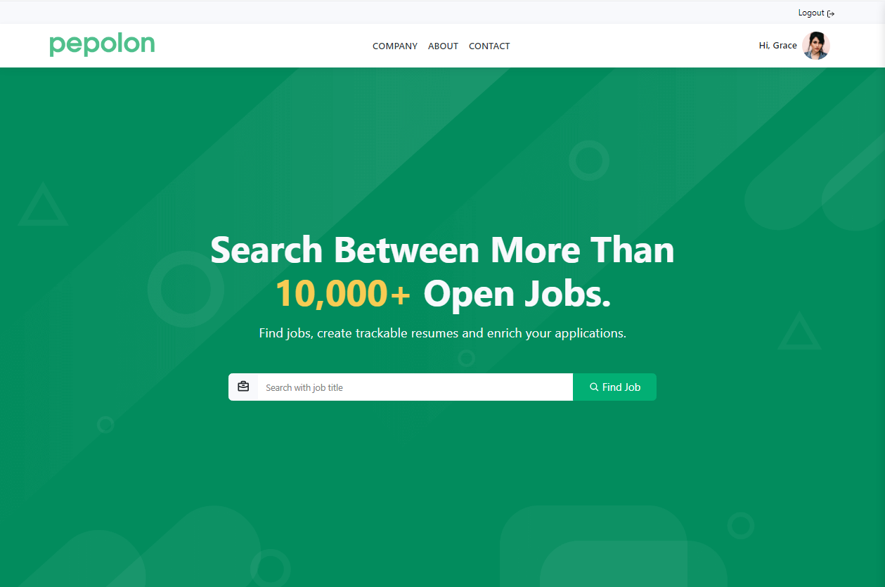
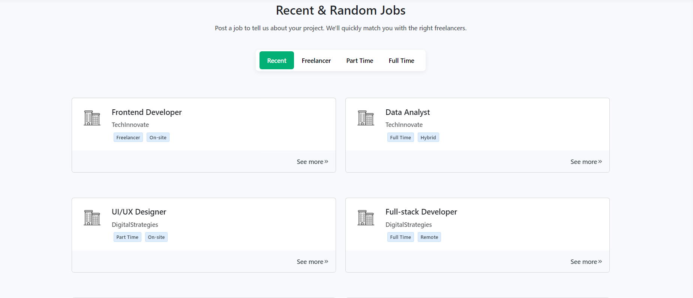

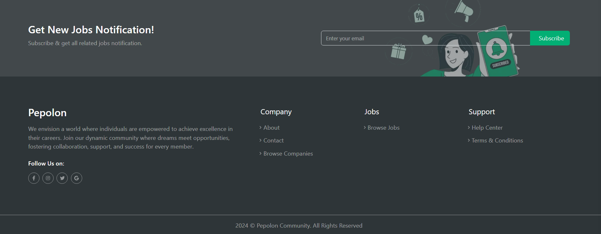

### About Page
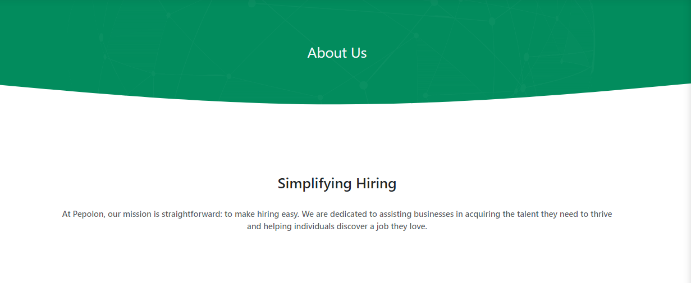
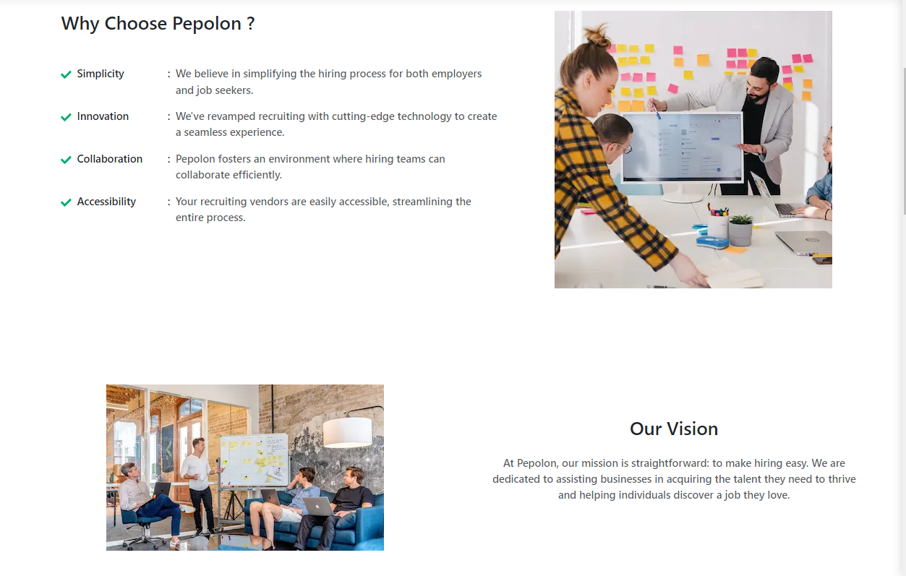
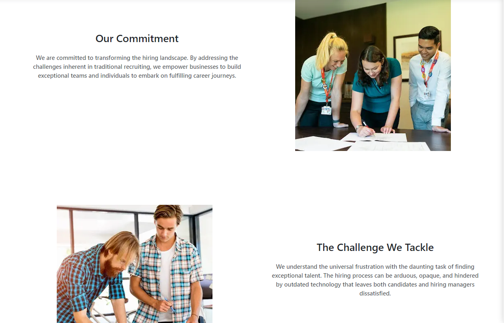

### Tenant Profile Pages
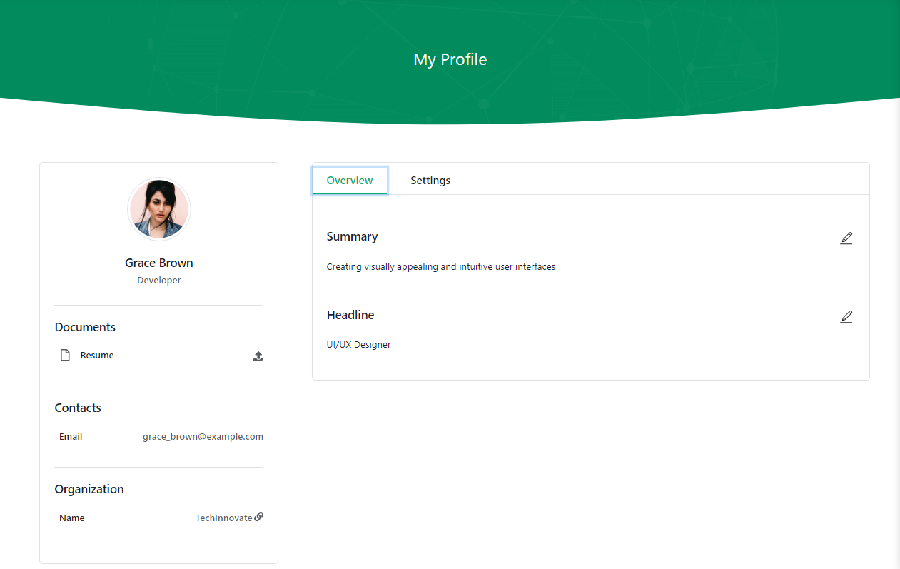
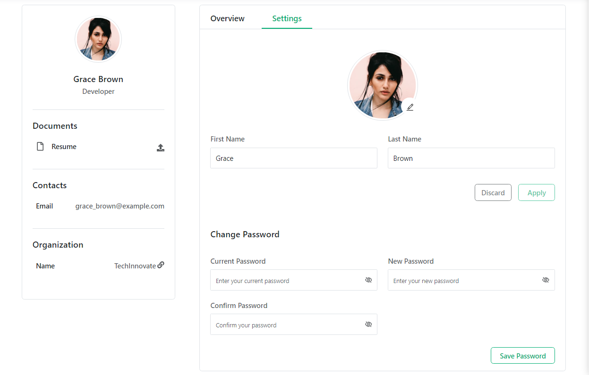

### Organization Profile Pages
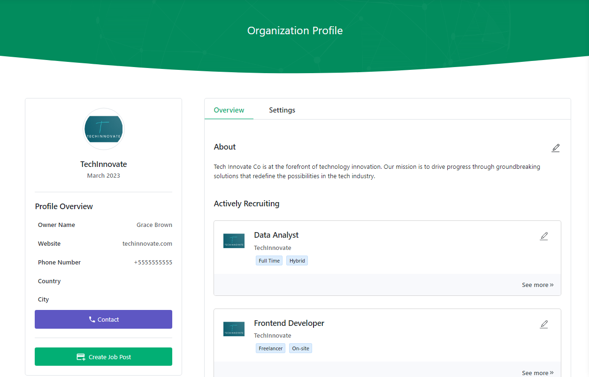
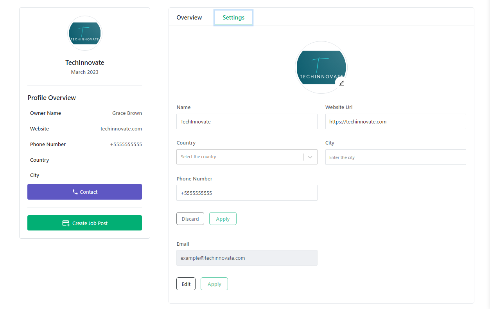
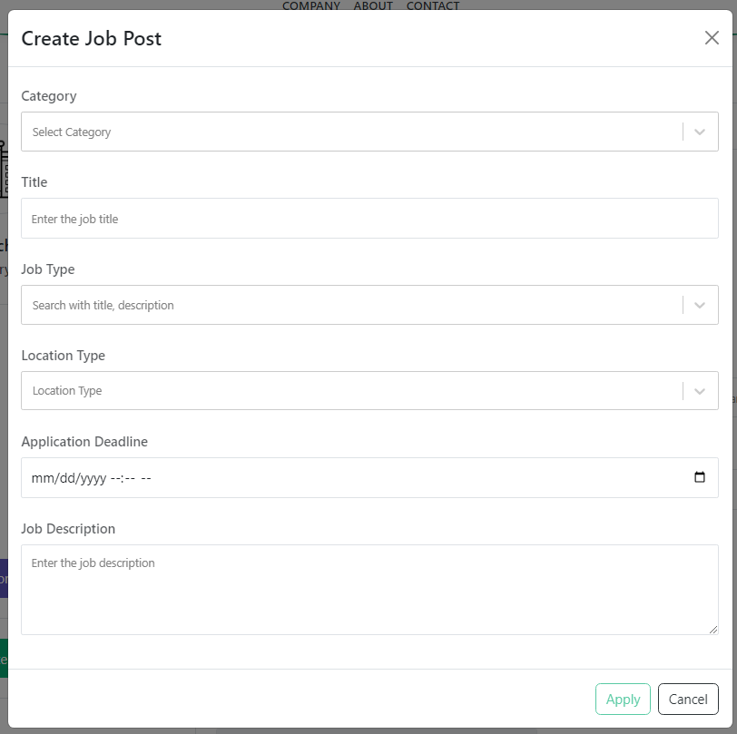
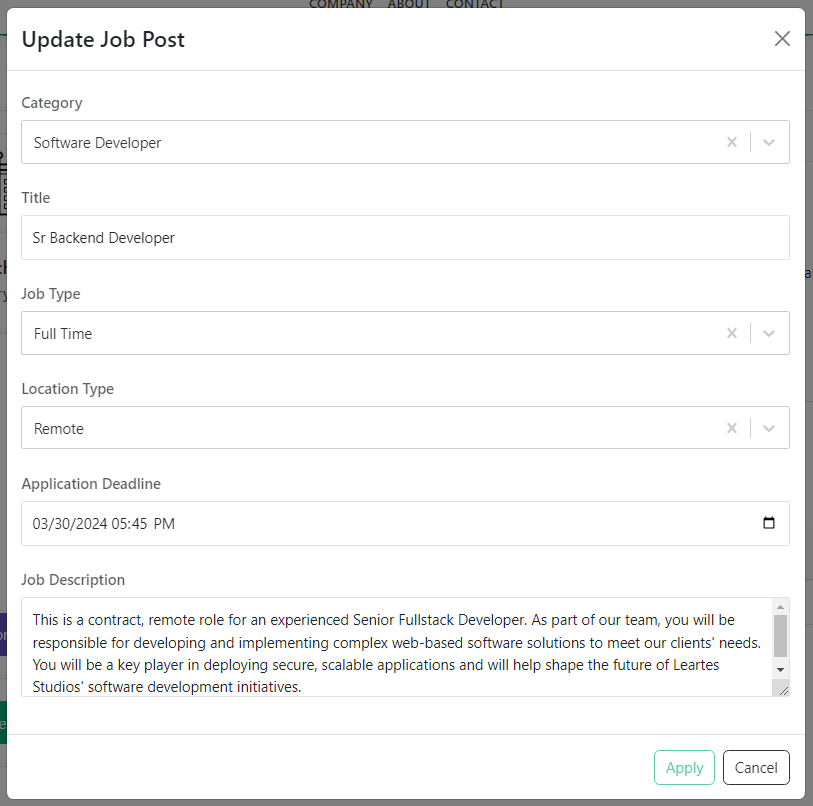

### Job Details Page
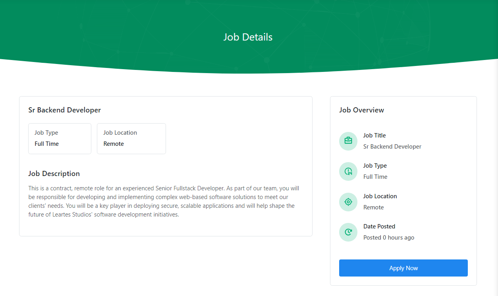
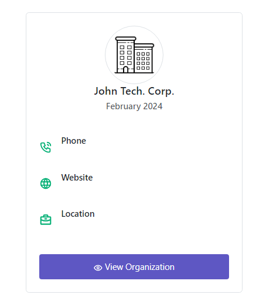

### Job Search Page
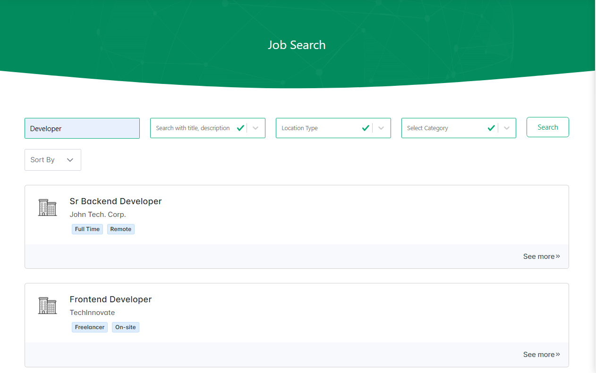

### Job Search Page
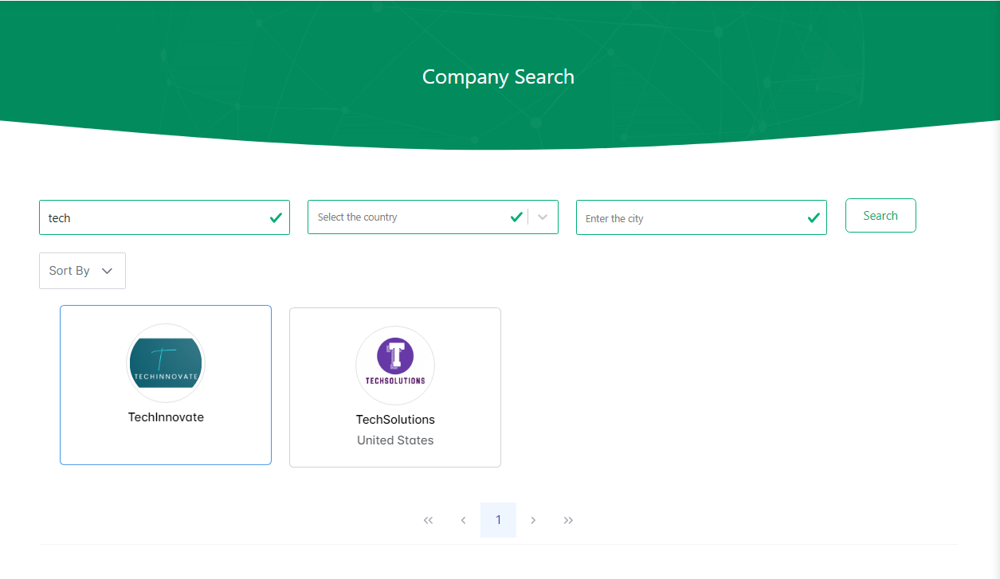

### Terms & Conditions Page
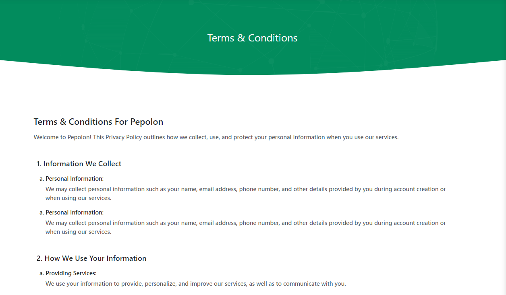

## Live
[Go to website](https://pepolon.com/){:target="_blank"} :arrow_upper_right:
