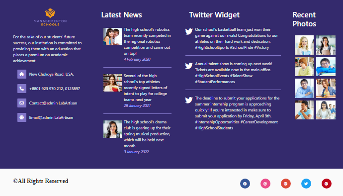
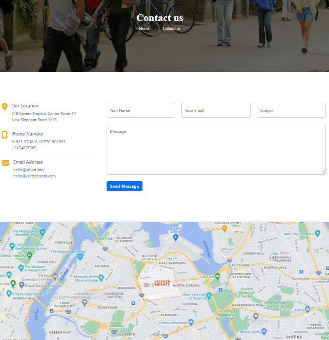
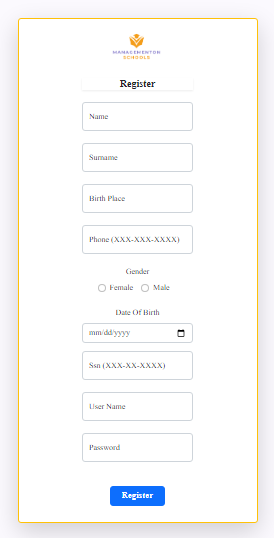
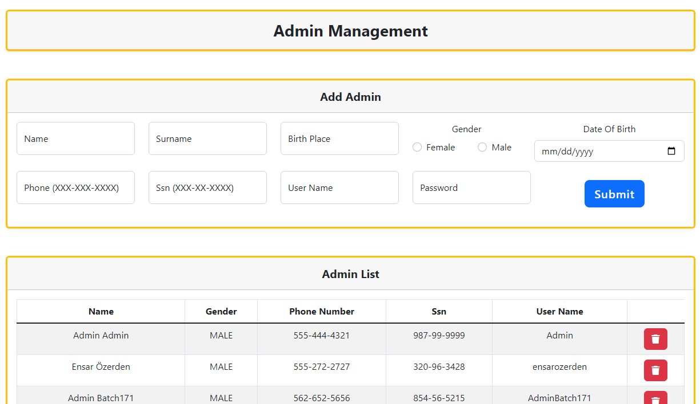
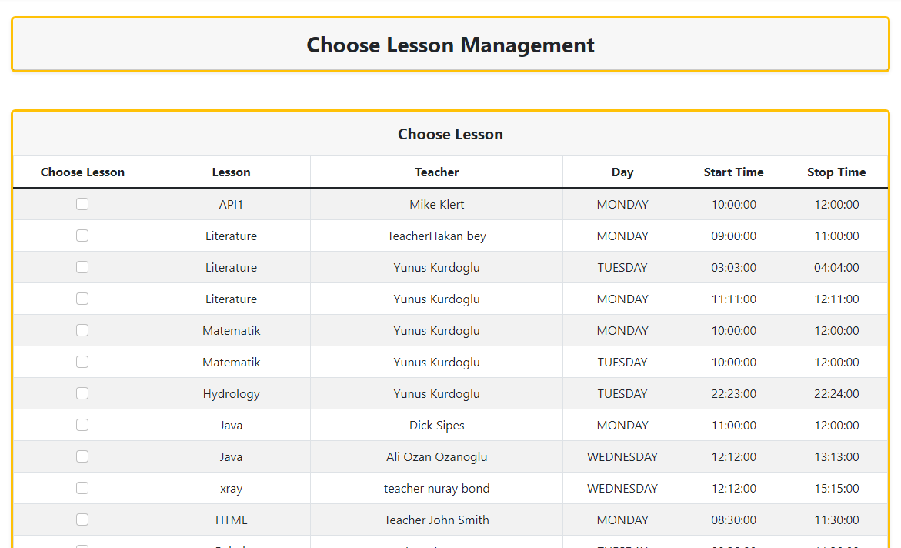
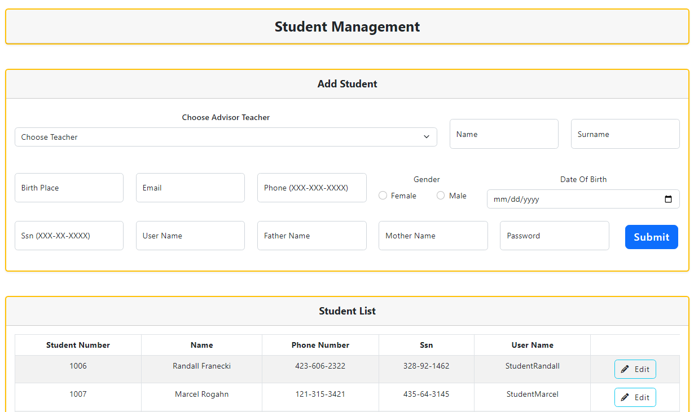
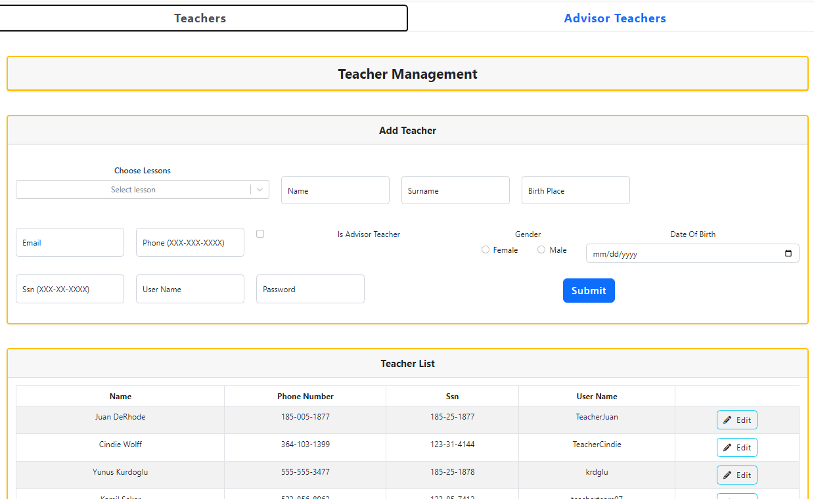

# Student Management System Frontend 

**Author:**  
_Burak Inan_   
_burakinan.dev@gmail.com_

---

## Description:

The Student Management System Frontend is built using ReactJS to provide a user-friendly interface for managing various entities within an educational institution. This frontend seamlessly integrates with the backend project, offering administrators, teachers, and students a comprehensive set of features to interact with the Student Management System.

## Technologies Used:

- **React (v18.2.0):** A JavaScript library for building user interfaces, providing a responsive and dynamic front end.

- **React Router DOM (v6.16.0):** A library for declarative routing in React applications, facilitating navigation and URL handling.

- **React Redux (v8.1.3):** State management library for React applications, ensuring efficient and predictable state handling.

- **Axios (v1.5.1):** A popular HTTP client for making asynchronous requests, simplifying data fetching and manipulation.

- **Bootstrap (v5.3.2):** A CSS framework for building responsive and visually appealing user interfaces.

- **Formik (v2.4.5):** A library for handling forms in React applications, simplifying form validation and submission.

- **Yup (v1.3.2):** A schema validation library used in conjunction with Formik for form validation.

- **React-Bootstrap (v2.9.0):** Bootstrap components as React components, enhancing UI development with pre-built elements.

- **React Data Table Component (v7.5.4):** A feature-rich table component for React applications, simplifying the display and management of tabular data.

- **React Icons (v4.11.0):** A library providing a collection of popular icons as React components.

- **Encrypt Storage (v2.12.16):** A library for secure client-side storage, ensuring data confidentiality.

- **Moment (v2.29.4):** A library for parsing, validating, manipulating, and displaying dates and times in JavaScript.

- **PrimeReact (v10.0.2) and PrimeFlex (v3.3.1):** A UI library providing a set of high-quality React components for building interfaces.

- **React Input Mask Next (v3.0.0-alpha.12):** A library for creating input masks, ensuring consistent input formatting.

- **React Scripts (v5.0.1):** A set of scripts and configurations for bootstrapping and managing React applications.

- **SweetAlert2 (v11.7.31):** A library for creating beautiful and customizable alert modals in web applications.

- **Swiper (v10.3.1):** A touch-enabled slider library for creating responsive and interactive carousels.

- **Web Vitals (v2.1.4):** A library for tracking and reporting essential web performance metrics.

These technologies and libraries collectively contribute to the development of a robust, responsive, and feature-rich frontend for the Student Management System.


## Key Features:

### User Authentication and Authorization:

- **Secure Authentication:** Robust user authentication system ensuring secure login for administrators, teachers, and students.
- **Role-Based Authorization:** Role-based access control for different parts of the application, limiting access based on user roles.

### Intuitive User Interface:

- **Dashboard Overview:** An intuitive dashboard providing a comprehensive summary of key information.
- **User-Specific Views:** Tailored views for administrators, teachers, and students, ensuring a personalized experience.

### Management Functionality:

- **Admin Management:** Exclusive features and capabilities for administrators, allowing efficient management of system-wide settings and users.
- **Lesson and Course Management:** Comprehensive management tools for lessons, courses, and course selection processes.
- **Communication Messages:** System-wide communication through messages, with specific access and management rights for administrators and managers.

### Meeting and Grade Management:

- **Grades and Meetings:** Specialized sections for students and administrators to manage grades and meeting schedules.
- **Teacher and Student Management:** Tools for administrators to manage teacher and student information efficiently.

### Role-Based Routing and Access:

- **Protected Routes:** Role-based routing ensuring that users can only access sections relevant to their roles, enhancing security and user experience.

### Responsive Design:

- **User Layout:** Responsive user layout ensuring a seamless experience across various devices.
- **Mobile-Friendly:** Support for mobile devices, allowing users to access the system on the go.

### Error Handling and Navigation:

- **Unauthorized Access Page:** A dedicated page for unauthorized access, improving security awareness.
- **404 Page:** A custom 404 page for handling navigation to non-existent routes, enhancing user experience.

### Modular Code Structure:

- **Organized Codebase:** Well-structured and modular codebase, making it easy to maintain and extend.
- **Reusable Components:** Use of reusable React components for consistent design and functionality.

### Integration with Backend:

- **API Integration:** Seamless integration with the backend Student Management System APIs for efficient data exchange.

### Access Control:

- **Fine-Grained Access Control:** Granular access controls based on user roles, ensuring data privacy and security.


## Getting Started:

### Prerequisites:

- Node.js installed on your machine.
- Ensure the backend server is running.

### Installation:

1. Clone the repository:

    ```bash
    git clone "contact with me to take the codes"
    ```

2. Navigate to the project directory:

    ```bash
    cd it_pro_campus_project
    ```

3. Install dependencies:

    ```bash
    npm install
    ```

4. Run the application:

    ```bash
    npm run dev
    ```

5. Open your browser and navigate to [http://localhost:3000](http://localhost:3000)
## Screenshots:

### Home Page




### Courses Page


### Events Page


### Blog Page


### Contact Page


### Contact Page


### Dashboard Pages






## Live Demo
[Go to live demo](https://managementonschools.com/) :arrow_upper_right:

---

Feel free to customize the template based on your project's specific details and structure.